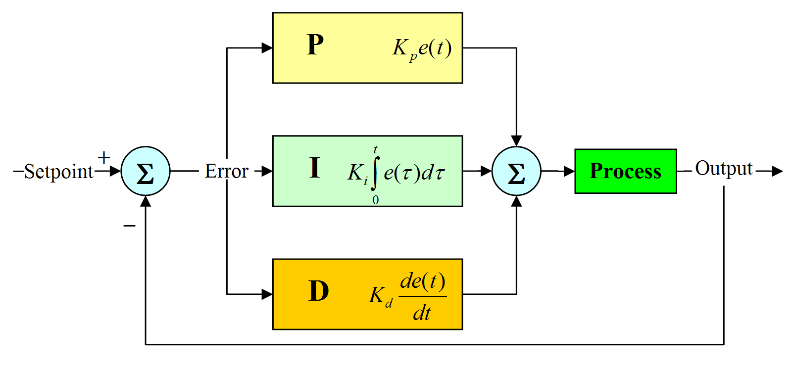
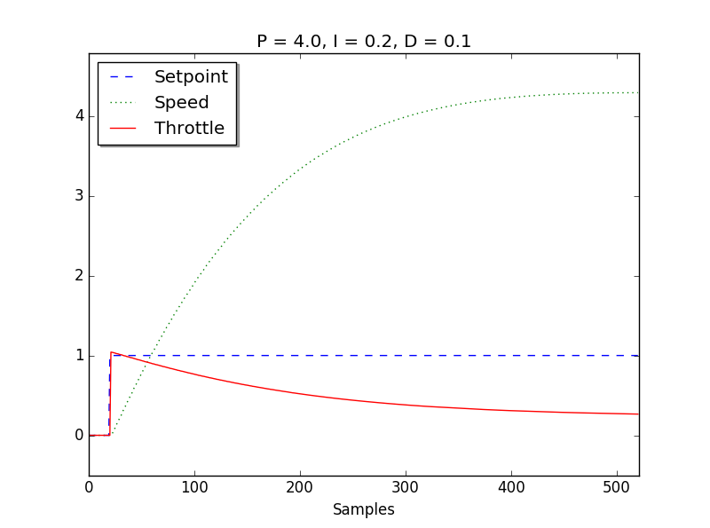
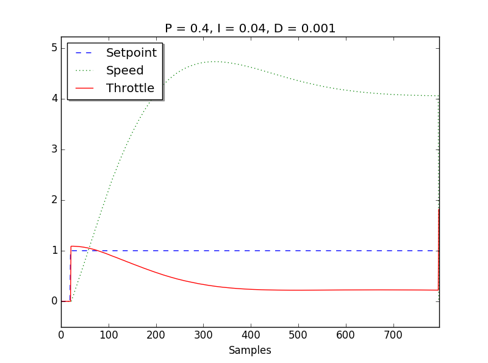
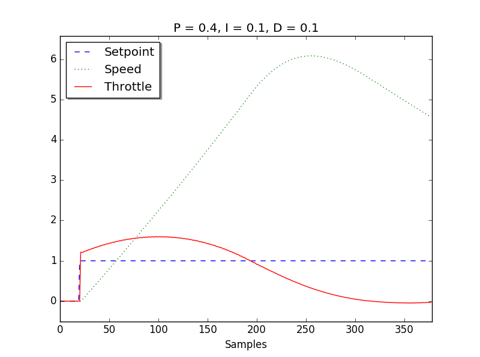

# kRPC - Hello World
====================

## Objective
------------
To use kRPC to complete one of the tests on Mk16 parachute.

The test requirements are -

  1. Altitude 3000m to 10000m
  2. Speed 111.0m/s to 230.0m/s

## Approach
-----------
Used PID controller to control the throttle by observing the speed of the rocket.
So, the system to be controlled is rocket, which takes "throttle" as the input from
the controller and produces "speed" as the output and feeds it back to the controller,
forming a closed loop system. Reference diagram is as follows -

A simple 3 stage rocket is used for this task, which has 2 liquid fuel tanks attached to
liquid fuel engine controlled from command pod. (.craft file can be found [here](krpc_test_hello_world.craft))

The PID library used can be found [here](https://github.com/ivmech/ivPID).

## Results
----------
Results generated with different PID values are hard-coded in the code and stored in
respective .csv files. Graphs are as follows -

Notice that above graphs are practically the same, but they are for different PID values.

0.4 and 0.02 seem to be magic values for P and I, for other combinations of P and I, 
the rocket doesn't get stable in the given range of 5000m to 8000m. Need to think about
that more. Plus, I should try to come up with the values for P and I using some standard
method (like Zeigler-Nicholas etc.) instead of being haphazard about it. 

P.S. - the value for speed is divided by 50 for better visualization purposes.
